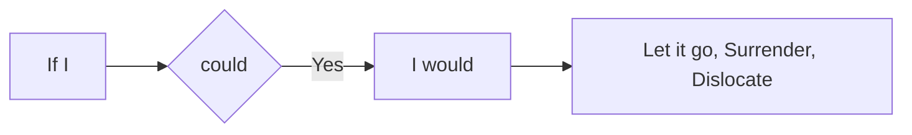
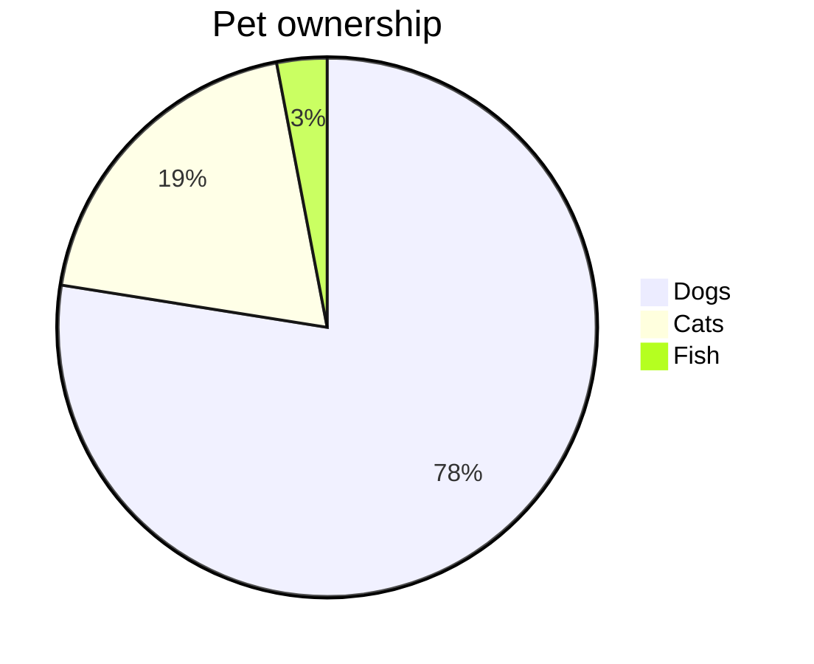
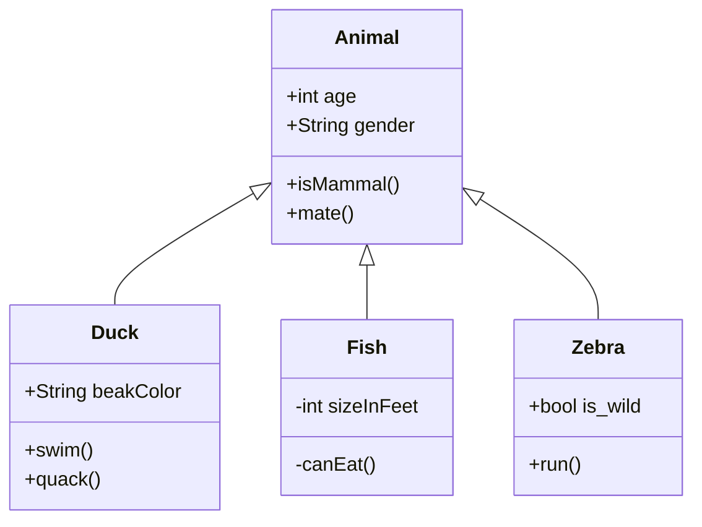

## Flowchart

```mermaid
flowchart LR
    A[If I] --> B{could};
    B -- Yes --> C[I would];
    C --> D[Let it go, Surrender, Dislocate];
```

## Pie chart

```mermaid
pie 
  title Pet ownership
  "Dogs" : 386
  "Cats" : 97
  "Fish" : 15
```

## Class diagram

```mermaid
classDiagram
      Animal <|-- Duck
      Animal <|-- Fish
      Animal <|-- Zebra
      Animal : +int age
      Animal : +String gender
      Animal: +isMammal()
      Animal: +mate()
      class Duck{
          +String beakColor
          +swim()
          +quack()
      }
      class Fish{
          -int sizeInFeet
          -canEat()
      }
      class Zebra{
          +bool is_wild
          +run()
      }
```

Refs:
https://mermaid-js.github.io/mermaid/#/classDiagram
https://github.blog/2022-02-14-include-diagrams-markdown-files-mermaid/
